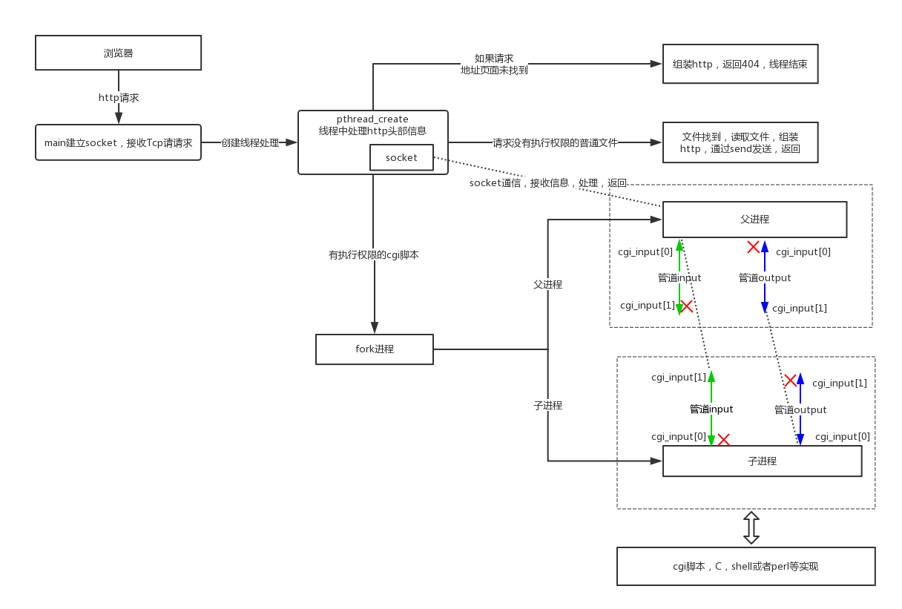
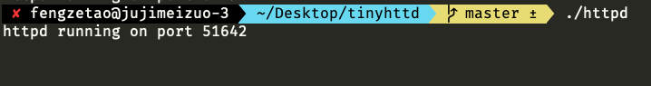
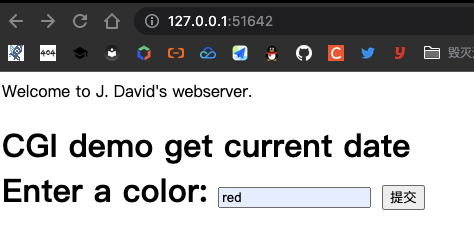
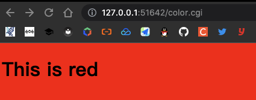
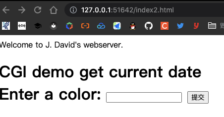
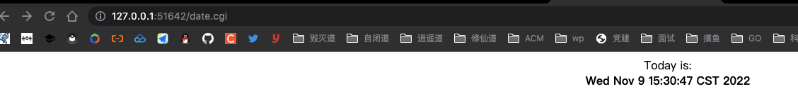

## tinyhttpd工作流程

## 核心函数说明
- startup: 			绑定监听套接字
- accept_request	每次收到请求，创建一个线程来处理接收到的请求
- serve_file		接读取文件返回给请求的http客户端
- execute_cgi		执行cgi文件

## 注意事项

index.html必须没有执行权限，否则看不到内容，并且会产生Program received signal SIGPIPE, Broken pipe，因为程序中如果有可执行权限会当cgi脚本处理。
所以假如html有执行权限先把它去除了，`chmod 600 index.html`

color.cgi、date.cgi必须要有执行权限，`chmod 755 *.cgi`

## 操作

#### 在项目文件目录下执行make

#### 在浏览器中输入 `127.0.0.1:port`

#### 测试color.cgi

#### 测试index2.html

#### 测试date.cgi

